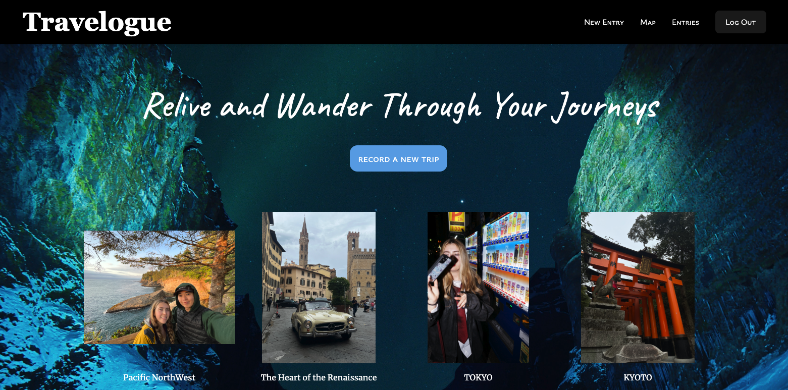

# TRAVELOGUE

A full PERN stack JavaScript application for travelers who want to document and relive their journeys.

## Why I Built This

As someone who loves traveling & bridging cultures, I wanted to create an application that allows users to easily log their trips, pin locations on a map, and store their travel memories in one place.

## Technologies Used

- TypeScript
- React
- Express
- Node.js
- PostgreSQL
- TailwindCSS
- AWS - EC2, RDS, ELB
- Google Maps API 
- Google Places API 

## Live Demo

Try the application live at [travelogue](http://ec2-3-19-155-17.us-east-2.compute.amazonaws.com/)

## Features

- Users can log trips with details such as location, date, and travel companions.
- Users can upload and view trip photos.
- Users can see all their trips pinned on an interactive map.
- Users can search for past trips based on location.

## Preview



## Development

### System Requirements

- Node.js 18.18 or higher
- NPM 10 or higher
- PostgreSQL 14 or higher


### Getting Started

1. Clone the repository.

   ```shell
   git clone https://github.com/ashleyavena/trip-journal
   cd trip-journal
   ```

1. Install all dependencies with NPM.

   ```shell
   npm install
   ```

1. Import the starting database to PostgreSQL.

   ```shell
   createdb tripJournalDb
   npm run db:import
   ```

1. Start the project. Once started you can view the application by opening http://localhost:5173 in your browser.

   ```shell
   npm run dev
   ```


